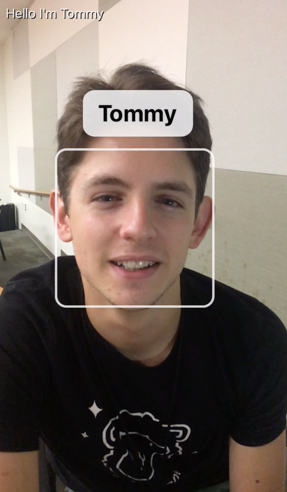

## Nametag AR

Nametag AR detects and remembers the names of people you meet. 

The app listens in the background for when people introduce themselves to you. When it detects an introduction (like *"Hi, I'm Jake"*), it saves the person's name and an image of their face. 

Once you've met somebody, Nametag AR will remember them for you. Whenever you see them again in the future, the app will overlay their name near their face so you don't forget who they are.

**[Watch a video demo](https://www.youtube.com/watch?v=Trg_Z-Nh9Ws)**

## Screenshots 

     

## Technologies

Nametag AR has four main pieces:

 - A **speech processor** built with Apple's **[Speech framework](https://developer.apple.com/documentation/speech)**. Continuously listens for the "Hi, I'm ___" keywords (plus other common variations).

 - A **face detector** built with Apple's **[Vision framework](https://developer.apple.com/documentation/vision)**. Analyzes an inbound video stream to identify individual faces and crop them in to standalone images.
 

 - A **facial match system** built with Microsoft Azure's **[Face API](https://azure.microsoft.com/en-us/services/cognitive-services/face/)** and a **[Node.js server](https://github.com/helluva/Nametag-server)**. Builds a repository of the faces you've seen so far compares new faces against that repository.
 

 - An **augmented reality scene** which renders informational overlays (most importantly, the names of people on screen) on top of your inbound video stream.